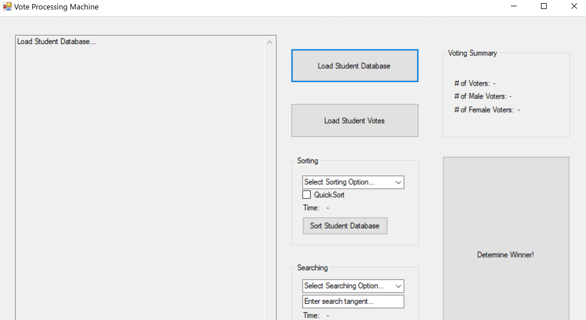

# Vote-Processor
_Student Council Vote Processor Windows Form Application_ 

Written in C# with Visual Studio 2019 and Access Database

## Features
- Voter login form
- Voter Verification form
- Voter turnout stats
- Vote results graph
- Sorting and searching thorugh verfied voters 
